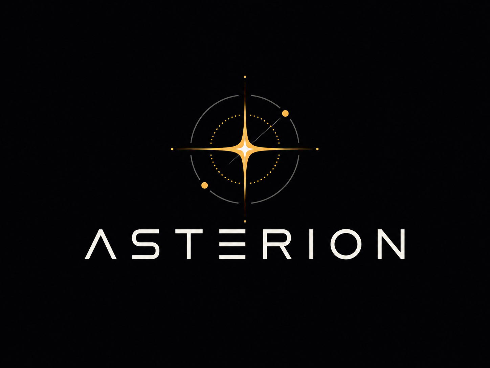

<p align="center">
  
</p>

<h1 align="center">Asterion — Local-First Investment Research Cockpit</h1>

<p align="center">
  A local-first research terminal that combines SEC filings, deterministic
  financial ratios, valuation scorecards, portfolio risk, and an explainable UI.
</p>

<p align="center">
  <a href="#quickstart">Quickstart</a> ·
  <a href="#features">Features</a> ·
  <a href="#architecture">Architecture</a> ·
  <a href="#commands">Commands</a> ·
  <a href="#license">License</a>
</p>

---

> ### ⚠️ Disclaimer
> **Asterion is not financial advice.** It does **not** issue buy/sell
> recommendations. It is a research and risk-analysis tool. All outputs are for
> informational and educational purposes only. Markets are noisy, reflexive, and
> adversarial — Asterion estimates probability, expected value, uncertainty, and
> downside risk. It does not promise prediction. Do your own research; consult a
> licensed professional before investing.

---

## Why Asterion

Deterministic math is the skeleton. A **local** LLM is the analyst, not the
oracle. No fake predictions, no invented numbers, no LLM-calculated ratios, no
buy/sell signals without confidence, risk, and a thesis-invalidation condition.
Everything runs on your machine: Postgres + Ollama, no data sent to a vendor by
default.

## Features

- **Local-first portfolio research cockpit** — your holdings never leave your machine.
- **SEC / XBRL ingestion** — rate-limited, backoff, full provenance on every fact.
- **Deterministic financial ratios** — reproducible, no LLM arithmetic.
- **Forensic scores** — accrual, dilution, reflexivity, thesis-fragility signals.
- **Reverse DCF** — solves for the growth the market is already pricing in.
- **Dynamic WACC** — CAPM with FRED risk-free rate + provider/sector beta (honest fallbacks).
- **FCF / capex coverage** — cash-flow durability checks from SEC facts.
- **Portfolio concentration risk** — single-name and theme exposure policy warnings.
- **Daily contribution analysis** — what moved the book and why.
- **Market data provider abstraction** — Finnhub / FMP / FRED, swappable, optional.
- **Beginner / Pro UI** — progressive disclosure for two audiences.
- **One-command local launcher** — `make start`, no Docker required.

### Example output

A generated company valuation scorecard (public-company data, no personal info):
[`examples/reports/NVDA_valuation_scorecard.md`](examples/reports/NVDA_valuation_scorecard.md).

## Architecture

```
┌──────────────┐   ┌─────────────────────┐   ┌──────────────┐
│  Frontend    │   │  Backend (FastAPI)  │   │  Postgres 16 │
│  Next.js +TS │◄─►│  ingestion · quant  │◄─►│  +Timescale  │
│  Beginner/Pro│   │  scoring · valuation│   │  +pgvector   │
└──────────────┘   │  rag · llm · policy │   └──────────────┘
                   └──────────┬──────────┘
                              │
                ┌─────────────┼──────────────┐
                ▼             ▼              ▼
        Market providers   Ollama (local   reports/
        Finnhub/FMP/FRED    LLM + embed)   (generated)
```

- **Frontend** — Next.js + TypeScript dashboard (Beginner & Pro modes).
- **Backend** — FastAPI: SEC ingestion → deterministic quant → valuation/WACC →
  local RAG → local LLM memos → rules-based policy engine.
- **Postgres** — Timescale + pgvector for facts, prices, and embeddings.
- **Market providers** — thin, optional abstraction (quotes, beta, macro).
- **Reports** — deterministic markdown/JSON scorecards (gitignored when private).
- **Local launcher** — `scripts/*.sh` + `Makefile` for one-command dev.

## Quickstart

```bash
# 1. Clone
git clone <your-fork-url> Asterion
cd Asterion

# 2. Config — copy templates, then fill (all API keys are optional)
cp .env.example .env                       # DB, Ollama, SEC user-agent
cp backend/.env.example backend/.env       # optional provider keys
#   edit ASTERION_SEC_USER_AGENT to "Your Name (you@example.com)" — SEC requires it

# 3. Backend
cd backend
python -m venv .venv && source .venv/bin/activate
pip install -e ".[dev]"

# 4. Database (Postgres 16, or `docker compose up -d postgres`)
python ../scripts/migrate.py               # apply migrations

# 5. Frontend
cd ../frontend && npm install && cd ..

# 6. Run everything (no Docker)
make start                                 # boots :8000 + :3000, opens /market
```

Then open <http://localhost:3000/market>.

### Try it with the sample portfolio (demo mode)

Asterion ships with fake demo holdings so you can run it without your own data:

```bash
cd backend && .venv/bin/python ../scripts/import_portfolio.py ../examples/sample_portfolio.csv
.venv/bin/python ../scripts/generate_portfolio_report.py
```

## API keys

All keys are **optional**. Without them, Asterion uses fallback / stored data
where possible (and clearly labels the source).

| Key | Purpose | Without it |
|-----|---------|-----------|
| `FINNHUB_API_KEY` | Live quotes | Uses stored prices |
| `FRED_API_KEY` | 10Y Treasury → risk-free rate | Static 4.5% fallback |
| `FMP_API_KEY` | Beta / fundamentals | Sector-fallback beta |
| `ASTERION_SEC_USER_AGENT` | SEC EDGAR ingestion (real email required) | SEC ingestion disabled |

## Commands

```bash
make start     # boot backend (:8000) + frontend (:3000), open /market
make stop      # stop both servers (only ports 3000/8000; nothing else)
make health    # green/yellow/red: providers configured? portfolio total sane?
make logs      # tail logs/backend.log + logs/frontend.log
```

Optional shell aliases — add to `~/.zshrc` (point the path at your clone):

```bash
alias ast='cd /path/to/Asterion && make start'
alias astop='cd /path/to/Asterion && make stop'
alias ahealth='cd /path/to/Asterion && make health'
```

## Data honesty

This is the core contract:

- **Missing data is shown as missing.** Asterion never fakes unavailable
  financial data.
- **Scores degrade confidence when inputs are missing** — every output carries a
  confidence and a list of missing inputs.
- **No LLM arithmetic.** All ratios, multiples, and valuations are computed
  deterministically from SEC facts; the LLM only explains, never calculates.
- **Every number is traceable** to a SEC fact, price bar, or named provider.

## Roadmap

- Provider beta + macro calibration (live FRED/FMP across the universe)
- Better 0–100 score calibration
- Public demo mode (one-command sample dataset)
- Richer report exports
- Optional compliance / risk layer (later)

## Contributing

See [`CONTRIBUTING.md`](CONTRIBUTING.md) for local setup, tests, coding
standards, and the no-secrets / no-recommendation rules. Security policy:
[`SECURITY.md`](SECURITY.md).

## License

Licensed under **AGPL-3.0** — see [`LICENSE`](LICENSE). Open-core protection: if
someone runs a modified Asterion as a hosted/network service, their changes must
remain open-source.
